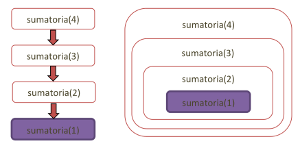
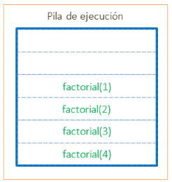
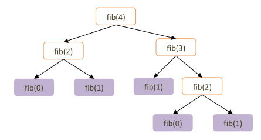
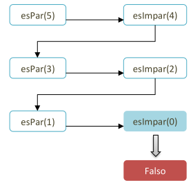

# Introducción a la Recursión
En esta sección nos iniciaremos en el concepto de recursión aplicado con el lenguaje Python. El concepto de la recursión es uno de los más interesantes y desafiantes en el diseño de algoritmos ya que permite modelar soluciones elegantes a problemas particulares. Su aplicación en diversas técnicas de resolución de problemas ofrecen las bases para implementar estructuras complejas de gran utilidad, como lo son los árboles y todos sus derivados, problemas de optimización en grafos, búsquedas no determinísticas, etc.

## Un problema recursivo

Imaginemos que nos han encargado la tarea de censar los habitantes de un país. Para facilitar el ejemplo, sólo nos interesa averiguar la cantidad de habitantes. Un enfoque de resolución iterativo y lineal, tal como vimos en el paradigma imperativo, sería comenzar por el pueblo que se encuentre más al noroeste, tocar el timbre de la primera vivienda de la manzana más al noroeste, contar los habitantes de la misma, y avanzar en sentido este y luego sur, abarcando el resto de los pueblos del país uno a uno, repitiendo el conteo en cada vivienda. Sin dudas sería un recorrido muy largo, implicando un gran costo de traslado y probablemente alguna vivienda quede sin registrar. La tarea resulta realmente muy difícil de realizar por una persona.

Veamos un enfoque diferente, tratemos de **dividir este problema en otros problemas similares**, pero de **menor dimensión**. Podríamos decir que censar los habitantes de un país es similar a censar los habitantes de una provincia, ya que un país se divide en varias provincias. El problema es en realidad el mismo, sólo que **se ha divido en varios subproblemas de dimensión reducida**. Claramente, la tarea de censar una provincia sigue
siendo lo suficientemente compleja para una persona. Por lo tanto, podemos proponer que el problema de censado de una provincia es similar a censar un partido. Como también es similar el problema de censar un partido en relación al censo de una comuna o barrio. Todos ellos son problemas divisibles en subproblemas similares con dimensiones reducidas.

> Este proceso de subdivisión de problemas propuesto se apoya en la estrategia de diseño de algoritmos **divide y vencerás** (_divide & conquer_). El propósito es **descomponer** un problema de gran complejidad en diversos subproblemas similares que puedan resolverse con mayor facilidad para luego **combinar esas subsoluciones en una solución final**.

Pensamos así en resolver el problema del censo con el diseño de solución **divide y vencerás**, donde se descompone el tamaño del problema a través de reducir el área a censar. La operación de censado es siempre la misma, sólo que se aplica a instancias de problemas más pequeñas (áreas más reducidas).

> La resolución recursiva se basa en la idea de que una función puede llamarse a sí misma para resolver un problema más grande dividiéndolo en subproblemas más pequeños.

Seguramente nos preguntemos entonces, **¿hasta dónde dividimos el problema?** La respuesta dependerá obviamente del problema, pero la idea es dividir hasta que la solución de la tarea aplicada a cada subdivisión sea trivial o relativamente sencilla de realizar. En nuestro caso, podría ser dividir hasta el nivel de vivienda o incluso persona (lo cual devolvería el valor 1).

> La instancia del problema donde **no se requieren subdivisiones adicionales para resolverlo**, es denominada **caso base** de la recursión. Todo problema recursivo **tiene uno o más casos base que determinan el final de la recursión**.

> La instancia del problema donde requerimos subdividir, computar recursivamente soluciones parciales y combinarlas, se la denomina **instancia o caso recursivo**.

Entonces, del ejemplo provisto podemos decir que:
- El caso base es cuando censamos una vivienda que nos devuelve la cantidad de convivientes.
- El caso recursivo realiza lo siguiente:
    1. Dividir la zona a censar en n subzonas.
    2. Realizar el censo de cada subzona obtenida del paso 1.
    3. Sumar los resultados de los censos realizados en el paso 2.
    4. Devolver la suma del paso 3.

Veamos cómo lo traducimos en Python.

```python
def censar(zona: Zona) -> int:
    if zona.es_vivienda():
        return zona.habitantes
    else:
        habitantes: int = 0
        for subzona in zona.subzonas:
            habitantes += censar(subzona)
        return habitantes
```
Nos apoyamos en una clase `Zona` que define de forma abstracta el concepto de país, provincia, departamento, etc. Asumimos que una vivienda tiene un atributo propio `habitantes` que nos dice la cantidad de personas que viven allí. El resto de las especializaciones de `Zona` tienen un atributo `subzonas` que es una lista de zonas que la conforman.

### Diseño de una operación recursiva
Del ejemplo mencionado podemos definir una **estructura de operación general** para resolver un problema recursivo.
```
funcion resolver(problema)
    si problema es simple entonces
        devolver solucion
    sino
        dividir problema en subproblema1..N
        resolver(subproblema1)
        resolver(subproblema2)
        ..
        resolver(subproblemaN)
        combinar_soluciones
        devolver solución
    finSi
finFuncion
```
Siempre debemos contemplar incorporar el o los casos bases para poder darle corte a las invocaciones recursivas, por eso se muestra aquí con un `if` bien explícito (aunque no siempre será necesariamente así). Luego en el caso recursivo (la sección del `else`), realizamos primero las divisiones necesarias en subproblemas y los utilizamos para resolver parcialmente el problema con invocaciones recursivas. Finalmente se combinan esas soluciones parciales para devolver el resultado de esa instancia del problema.

### Ejercicio: Modelar las zonas para censo
Implementar las clases necesarias para modelar las diferentes zonas a censar, donde país es la más amplia y se compone de provincias, etc. Todas deben tener un atributo de subzonas que representa la lista de zonas que las conforman, excepto la clase de vivienda que tiene el atributo habitantes. Finalmente, incorporar la operación recursiva de censar como método en la clase abstracta `Zona`.

## El orden de las instancias
En el ejemplo del censo vemos que el problema se divide a través de invocar una misma operación sobre una estructura más pequeña (subzona). Esto funciona porque en cada instancia recursiva estamos tratando un problema menor hasta llegar a un mínimo que es el caso base. Esto nos provee un **orden parcial estricto** del conjunto de elementos posibles de `Zona`, ya que hablamos de una relación **irreflexiva, asimétrica y transitiva**. Cuando trabajamos con estructuras recursivas, como la zona que se compone de un conjunto de otras zonas, podemos apoyarnos en este orden que surge entre sus elementos para aplicar operaciones recursivas ya que siempre tendremos **uno o más elementos mínimos** para tomar como casos base.

> Para implementar una solución recursiva las instancias de recursión o subestructuras recursivas deben relacionarse mediante un **orden bien fundado**, cualquier subconjunto de elementos ordenados debe tener un elemento mínimo.

De esta forma garantizaremos que **toda instancia o elemento se descompone necesariamente en subinstancias o subelementos menores** (desde el punto de vista de la relación de orden) y que su descomposición se puede realizar hasta alcanzar una **instancia o elemento mínimo**. 

Veamos el ejemplo de la sumatoria:

`sumatoria(n) = 1 + 2 + 3 + ... + n`

En este caso podemos identificar la relación de orden total que existe en la estructura recibida por parámetro (los números enteros), pero en la sumatoria este parámetro está acotado a un subconjunto de números, aquellos mayores a 0. Este subconjunto representa un orden bien fundado donde el mínimo es el `1`. Así que podemos inferir que nuestro caso base será cuando invoquemos la sumatoria con ese elemento mínimo.

La idea ahora es pensar cómo resolver un caso recursivo **a partir de una instancia más pequeña**. Cuando trabajamos con números enteros, la solución más simple suele ser resolver una instancia `n` a partir de una decrementada `n - 1`. Podríamos escribir la sumatoria así:

```m
--- caso base ---
sumatoria(1) = 1

--- caso recursivo ---
sumatoria(n) = (1 + 2 + 3 + ... + n-1) + n
sumatoria(n) = sumatoria(n-1) + n
```
No siempre veremos tan clara la construcción de una solución a partir de una recursión sobre instancia menor, es un ejercicio que lleva práctica. En este caso surge de forma sencilla y nos permite producir una solución simple y más elegante que una solución iterativa utilizando un bucle.

```python
def sumatoria(n: int) -> int:
    if n < 2:
        return 1
    else:
        return sumatoria(n-1) + n
```
El caso base aquí _intenta_ acotar el dominio de la función, aunque no respeta la función matemática real ya que **debería arrojar excepción con valores de `n < 1`**. Veamos la versión que contempla todo esto.

```python
def sumatoria(n: int) -> int:
    if n < 1:
        raise ValueError(f'Se recibe {n}, n debe ser mayor a 0')
    elif n == 1:
        return 1
    else:
        return sumatoria(n-1) + n

sumatoria(10)   # 55
sumatoria(-2)   # ValueError: Se recibe -2, n debe ser mayor a 0
```
Esta consideración sobre la entrada es **fundamental para evitar problemas de recursión infinita**. Es análogo al caso de bucle infinito, cuando definimos mal la condición de corte de una iteración. Por eso es clave siempre **identificar los elementos mínimos** que marcan los casos base y que se **invoque a instancias más reducidas** en cada recursión.

Finalmente, veamos cómo quedaría representado el orden bien fundado en las sucesivas
llamadas de la función sumatoria (4).



### Ejercicio: Jugando con dígitos
Definir lo siguiente:
- a. Una función recursiva digitos, que dado un número entero, retorne su cantidad de dígitos. 
- b. Una función recursiva reversa_num que, dado un número entero, retorne su imagen especular. Por ejemplo: reversa_num(345) = 543
- c. Una función recursiva suma_digitos que, dado un número entero, retorne la suma de sus dígitos.
- d. Una función recursiva que retorne los dos valores anteriores a la vez como un par, aprovechando la recursión.

## Tipos de recursión
Intentaremos proponer algunas clasificaciones que son interesantes para identificar problemas recursivos según ciertas características.

> Recordemos que la recursión puede presentarse tanto a nivel de procedimientos o funciones, como así también en estructuras de datos.

### Clasificación según referencias
Se basa en la cantidad de referencias recursivas que existen de un elemento a sí mismo, sean llamadas a bloque de código o composiciones de subestructuras de mismo tipo.

#### Recursión simple
Existe una única llamada recursiva en una función o procedimiento, o bien, una estructura de datos se compone con un elemento del mismo tipo de datos que se está definiendo. También denominada **recursión lineal**. Por ejemplo, la sumatoria que vimos antes o el factorial.

```python
def factorial(n: int) -> int:
    if n <= 1:
        return 1
    else:
        return factorial(n-1) * n
```
Al igual que con la sumatoria y muchas otras operaciones recursivas, notemos que en el caso recursivo necesitamos computar antes `factorial(n-1)` para luego multiplicar el resultado con `n`. Cuando entramos en esa recursión, la instancia actual del factorial se detiene esperando el resultado mencionado, por lo cual nos estamos apoyando en la **pila de ejecución** para almacenar las variables locales, punteros de retorno, etc.



Esta imagen muestra el estado de la pila de ejecución cuando se llega al caso base `factorial(1)`, donde aún quedan apilados todos los casos previos ya que no finalizan hasta se aplique la multiplicación por `n`.

#### Recursión múltiple
Sucede cuando las referencias a sí mismo superan la unidad. Podemos identificar casos particulaes como **recursión doble** o **recursión triple** si son dos o tres referencias recursivas respectivamente. Un ejemplo común de recursión doble es el de fibonacci.

```python
def fibonacci(n: int) -> int:
    if n <= 1:
        return n
    else:
        return fibonacci(n-1) + fibonacci(n-2)
```
En general la recursión múltiple es muy ineficiente ya que **se genera un árbol de invocaciones**, a diferencia de la recursión simple que es una secuencia de invocaciones. En casos donde se invoquen varias veces una misma instancia recursiva y se respete la transparencia referencial, es posible utilizar la técnica de **memoization** que almacena el resultado en memoria para evitar recomputarlo en próximas invocaciones.



Cuando invocamos `fibonacci(4)` se producen diversas invocaciones recursivas, generando así un árbol de invocaciones donde existen evaluaciones repetidas. Por ejemplo, `fibonacci(2)` se evalúa 2 veces en ese caso, si utilizamos _memoization_ sólo lo evaluaríamos una vez y reduciría notablemente la cantidad de invocaciones (se poda el árbol).

> Un estilo de diseño de algoritmos donde se divide un problema en subproblemas similares que se combinan en una solución recursiva y utilizando la técnica de _memoization_, se lo denomina **programación dinámica**.

Veamos un ejemplo para optimizar el caso de fibonacci.

```python
def fibonacci(n: int) -> int:
    calculados = {}

    def fibo_interna(n: int) -> int:
        if n < 0:
            raise ValueError('n debe ser mayor o igual a 0')
        if n <= 1:
            return n
        if n not in calculados:
            calculados[n] = fibo_interna(n-1) + fibo_interna(n-2)
        return calculados[n]
  
    return fibo_interna(n)
```
Almacenando las evaluaciones en un diccionario `calculados` logramos reducir la complejidad computacional en tiempo del algoritmo. Originalmente la complejidad era `O(2^n)` porque en cada caso recursivo se invocaba dos veces a sí mismo, y ahora con _memoization_ pasa a ser `O(n)` porque sólo se evalúa una vez cada número.

### Clasificación según dirección
Esta distinción se basa en determinar si la recursión ocurre o no en la misma operación. Esto también se aplica para el caso de estructuras recursivas.

#### Recursión directa
Cuando diseñamos una operación recursiva que realiza su invocación a sí misma dentro de su propio cuerpo, estamos hablando de una **recursión directa**. Los ejemplos vistos hasta el momento son de este tipo.

#### Recursión indirecta
Por el contrario, puede suceder que una operación vuelva a ser invocada a así misma a partir de invocaciones intermediarias a otras operaciones dentro de la instancia recursiva. En ese caso, hablamos de **recursión indirecta**.

`operacion1 -> operacion2 -> operacion3 -> operacion1`

Imaginemos que una `operacion1` invoca a otras intermedias hasta que la `operacion3` vuelve a invocar a `operacion1`. A pesar que dentro del código de `operacion1` no se vea una invocación a sí misma, existe allí también una recursión de `operacion1`, sólo que es de tipo indirecta. Podríamos pensar la secuencia de operaciones intermedias como código que se ejecuta previamente dentro del cuerpo de `operacion1` hasta llegar nuevamente a invocarse a sí misma.

> Un caso especial de recursión indirecta es donde intervienen sólo dos componentes y se la denomina **recursión mutua**.

Veamos el ejemplo para determinar un número par o impar.

```python
def es_par(n: int) -> bool:
  return n == 0 or es_impar(n - 1)

def es_impar(n: int) -> bool:
  return False if n == 0 else es_par(n - 1)

print(es_par(10))   # True
print(es_par(9))    # False
print(es_impar(4))  # False
print(es_impar(7))  # True
```
En este caso vemos cómo distinguir la paridad de un número entero no negativo. Si ingresáramos un número negativo se generaría la excepción `RecursionError` ya que se produce una recursión infinita. Ambas funciones llaman a la otra, generando así una **recursión indirecta**. 



La clasificación de par e impar es excluyente, donde si un número es par implica que el mismo no es impar, y viceversa. Si un número entero es par, entonces su predecesor será necesariamente impar, y viceversa.

### Clasificación según visibilidad

#### Recursión explícita
Hasta el momento modelamos funciones recursivas que se llaman directamente y en su bloque se puede ver claramente la invocación recursiva (recursión directa), o bien se puede seguir el código para encontrar que la recursión es indirecta. De una forma u otra, la ejecución siempre se realiza sobre una función o procedimiento recursivo. A este tipo de invocación la llamaremos **recursión explícita**, ya que se tiene visibilidad que se está ejecutando un bloque recursivo.

#### Recursión implícita
En algunos casos tendremos la necesidad de definir ciertas precondiciones para ejecutar luego un procedimiento recursivo. La invocación inicial se realiza mediante un procedimiento o función que no presenta recursión, el cual invoca a otro procedimiento o función que sí presenta recursión. Entonces, si analizamos el tipo de recursión desde el procedimiento o función inicial, se puede decir que presenta una **recursión implícita**.

Siguiendo el ejemplo de la paridad de un número, si queremos mostrar en pantalla si un número es par o impar, deberíamos implementar un procedimiento que luego invoque alguna de las funciones definidas previamente. Este procedimiento no será recursivo, sino nos apoyaremos en funciones ya definidas previamente. Este nuevo procedimiento presentará entonces una recursión implícita, dada por la invocación a las funciones recursivas `es_par` o `es_impar`.

```python
def mostrar_paridad(n: int) -> None:
    if es_par(n):
        print(f'{n} es par')
    else:
        print(f'{n} es impar')
```

### Ejercicio: Par-Impar mejorado
Adaptar la solución propuesta con recursión mutua para determinar si un número es par o impar pero permitiendo aceptar también números negativos.

### Ejercicio: Pares
Definir la operación procedimiento pares, que dado un número entero, muestre todos los pares de números enteros positivos que son suma del número entero dado. Por ejemplo, 5 = (1 , 4), (2, 3).
 
### Ejercicio: Desde-Hasta    
- Definir la función desde_hasta, que dados dos números enteros retorne una lista de números consecutivos donde el primer elemento de la lista resultante sea el primer elemento dado, y el último elemento de la lista resultante sea el segundo elemento dado.
- Redefinir las funciones sumatoria y factorial utilizando desde_hasta.
