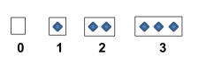
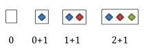
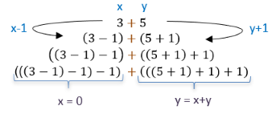
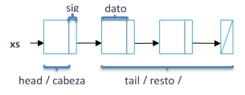
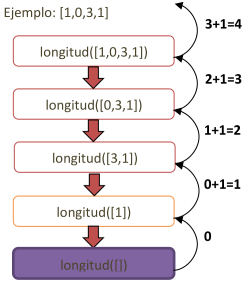

# Tipos Recursivos
En la [introducción a la recursión](./intro_recursion.md) vimos que podemos definir operaciones recursivas para solucionar problemas de esta naturaleza. Ahora pensaremos soluciones a partir del diseño de nuevos **tipos abstractos de datos (TAD) que se construirán a partir de sí mismos**, derivando en **tipos de datos recursivos**.

Más adelante veremos otros tipos recursivos más complejos, pero por el momento nos centraremos en tipos **lineales**, es decir, aquellos que se componen con una única referencia a sí mismos. Sería el análogo a la [recursión simple](./intro_recursion.md#recursión-simple) que vimos aplicada en operaciones.

Al igual que en una operación recursiva, en un tipo recursivo tendremos que modelar la estructura con **al menos un elemento mínimo que sea análogo al caso base**, de forma que podamos establecer **la relación del orden bien fundado entre sus elementos**. Entonces, el tipo recursivo siempre tendrá **al menos un elemento de construcción no recursivo y al menos un elemento que sí lo será**.

> Los tipos recursivos **necesitan implementarse con punteros**, ya que su naturaleza recursiva implica una **estructura infinita creciente** y es imposible de implementar de forma estática (necesitaríamos memoria infinita para hacerlo).

## TAD Nat
Comencemos con un clásico ejemplo sencillo de tipo de dato recursivo. Imaginemos que debemos construir un tipo de dato que represente los números naturales incluyendo el 0. Esta definición implica implementar un tipo de dato infinito, ya que no hemos puesto restricción a un número natural máximo. Veamos cómo podríamos repreentar esta abstracción.



La existencia de un elemento representa el número 1 natural, dos elementos representan el 2, tres elementos el 3, y así sucesivamente. La inexistencia de elementos representa el 0, entonces la cantidad de elementos representa el número natural.

Si pensamos esta estructura de forma recursiva, lo primero que podemos ver es una situación especial que se distingue del resto: la inexistencia de elementos, **el cero**. Ese valor sería análogo al caso base, es un elemento único en la estructura de naturales y no requiere definirse a través de una recursión.



En cambio los números mayores a cero vemos que respetan cierto patrón a medida que crecen. El número 1 se compone de un elemento más que el número 0, el número 2 se construye con un elemento más que el número 1, su predecesor, y así sucesivamente. Con este pensamiento inductivo podemos decir que el próximo número natural será igual al número actual con un elemento adicional, **el sucesor de un número natural se define a partir de su inmediato predecesor incrementado en uno**.

> Si analizamos el conjunto de los números naturales (incluyendo el 0) veremos que **no existe una sucesión infinita decreciente** en su estructura. Cualquier número natural dado, siempre podemos decrementarlo a números menores hasta llegar al 0, el cual es el elemento mínimo del conjunto. Así cumplimos con la condición de **orden bien fundado** necesaria en la recursión.

Si a la operación `+1` la definimos como `Sucesor`, podemos representar de forma recursiva todos los números naturales así:

| Número | Representación de la estructura |
|---|---|
| 0 | Cero |
| 1 | Sucesor(Cero) |
| 2 | Sucesor(Sucesor(Cero)) |
| ... | ... |
| n | Sucesor(...(Sucesor(Cero)) -> con n niveles recursivos de Sucesor |

### Estructura interna
Entonces nos queda pensar cómo diseñar una estructura que modele dos tipos de abstracciones: el Cero y el Sucesor. La primera abstracción simplemente identifica el valor mínimo de un número natural, mientas que la segunda permite construir el resto de los números naturales de forma recursiva. Dado que en Python no podemos operar directamente con punteros, veremos una forma de implementarlo con objetos.

```python
from typing import Union, TypeAlias

Nat: TypeAlias = Union["Cero", "Suc"]

class Cero:
    def __repr__(self):
        return 'Cero'

class Suc:
    def __init__(self, pred: Nat):
        self.pred = pred

    def __repr__(self):
        if isinstance(self.pred, Cero):
            return 'Suc(Cero)'
        else:
            return f'Suc({self.pred.__repr__()})'
```
En primer lugar establecemos que un objeto de tipo `Nat` puede ser una de las dos abstracciones que mencionamos mediante el uso del tipo `Union` que nos ofrece esta posibilidad. Entonces un objeto de tipo `Nat` puede ser una instancia de tipo `Cero` o `Suc`. Luego definimos ambas clases para modelar estas abstracciones.

La clase `Cero` no necesita una estrucura interna (atributos) ya que estamos modelando el elemento único que representa el cero. Es más, podría ser tranquilamente una clase abstracta ya que no necesitamos múltiples representaciones del número 0. Le sobreescribimos el método [`__repr__()`](../A_Python_POO/README.md#__repr__) para hacer la representación interna más fácil de leer.

La clase `Suc` representa la idea del _Sucesor_ y permite construir representaciones del resto de los números naturales. Su estructura requiere sólo saber cuál es el predecesor que también será de tipo `Nat`, aquí se ve la **recursión indirecta simple de la estructura**. Es indirecta porque `Nat` puede ser de tipo `Suc` y este último se compone de un `Nat`, precisamente una **recursión mutua**. 

También le agregamos el `__repr__()` que devuelve una representación de la estructura interna, lo interesante es que también es una operación recursiva que va recorriendo cada predecesor hasta llegar al `Cero` donde invoca el `__repr__()` de esa clase. Veamos que en cada instancia recursiva se agrega `Suc(...)` a la cadena devuelta.

### Operaciones básicas
Hasta el momento sólo diseñamos la estructura para implementar este nuevo TAD `Nat`, pero nos resta definir operaciones para consumirlo. Para facilitar la implementación, no encapsularemos `Nat` como una clase nueva, sino que definiremos las operaciones dentro de un [módulo](../A_Python_POO/README.md#módulos) que contiene las clases previas y todo el comportamiento necesario. Es un enfoque más imperativo clásico.

#### Constructoras
Antes que nada debemos implementar operaciones para generar elementos de este tipo `Nat`. Como hemos visto, necesitamos construir dos tipos de abstracciones: el cero y cualquier otro número. Por lo tanto continuamos con esa idea.

```python
def cero() -> Nat:
    return Cero()

def suc(n: Nat) -> Nat:
    return Suc(n)
```
La operación `cero()` simplemente devuelve un objeto de la clase `Cero`, mientras que `suc()` produce un nuevo objeto de la clase `Suc` incorporando como predecesor al objeto previo de tipo `Nat`. 

Veamos cómo se consumen.

```python
n1: Nat = cero()                # n1 representa al número natural 0
n2: Nat = suc(suc(suc(n1)))     # n2 representa al número natural 3

repr(n1)    # Cero
repr(n2)    # Suc(Suc(Suc(Cero)))
```
Las variables `n1` y `n2` son ambas de tipo `Nat`. La primera se inicializa con la constructora `cero()`, la segunda se asocia a un objeto generado por sucesivas invocaciones de `suc()` sobre `n1`. La cantidad de invocaciones de `suc()` determinan el nuevo _valor_ de `n2`. Luego podemos ver cómo se representa internamente cada objeto utilizando `repr()`.

#### Proyectoras
Veamos ahora algunas operaciones básicas que proyecten la estructura interna (estado) del tipo `Nat`.

```python
def es_cero(n: Nat) -> bool:
    return isinstance(n, Cero)

def pred(n: Nat) -> Nat:
    if es_cero(n):
        raise ValueError('cero no tiene predecesor')
    else:
        return n.pred
```
La función `es_cero()` comprueba simplemente si el objeto `Nat` es una instancia de tipo `Cero`, importante para comprobar como caso base en operaciones recursivas. La operación `pred()` nos devuelve el predecesor del número actual, sería la operación inversa del `suc()`.

```python
es_cero(n1)         # True
n2 = pred(n2)       # n2 representa al número natural 2
```

### Operaciones adicionales
A partir de las operaciones básicas podemos construir nuevas operaciones más complejas e interesantes para modelar el comportamiento de este tipo de dato. Por ejemplo, si quisiéramos representar el valor de los elementos de este tipo como un número entero primitivo en Python, podríamos hacer una operación que convierta ese tipo a `int`.

```python
def nat_to_int(n: Nat) -> int:
    if es_cero(n):
        return 0
    else:
        return 1 + nat_to_int(pred(n))
```
La solución es recursiva porque lo es también la estructura de `Nat`, entonces nos apoyamos en el caso base dado por el `Cero` para determinar que es el número `0`. El caso recursivo primero computa el valor `int` del predecesor del `n` actual invocándose a sí mismo y luego simplemente le adicionamos `1`. Esta función puede ser útil para llamarla desde métodos `__str__()` y así el `print()` de variables de tipo `Nat` mostraría su representación como `int`.

Otra operación interesante es la `suma()`. Recordemos que no existe una implementación para utilizar con el operador `+` con tipo `Nat`, por lo cual debemos definir cómo sumar dos elementos de este tipo. Utilizaremos una estrategia recursiva donde iremos decrementando el primer operando en una unidad a la vez que incrementaremos el segundo operando también en una unidad. La formulación sería así:
- `suma(0, y) = y` (caso base para `x == 0`)
- `suma(x, y) = suma(x-1, y+1)` (caso recursivo para `x <> 0`)

Veamos cómo se aplica esta idea paso a paso para resolver `3 + 5`.



En cada paso realizamos el decremento de `x` y el incremento de `y` hasta llegar al punto donde `x = 0`, donde sabremos que `y` representa ahora el valor de la suma de los operandos originales. Observemos que la recursión se aprecia en cada paso donde se sigue utilizando el operador `+`, sólo que sobre operandos modificados. A su vez, podemos notar el orden bien fundado en el operando `x` que se va decrementando hasta llegar al mínimo `0`. En Python quedaría así:

```python
def suma(x: Nat, y: Nat) -> Nat:
    if es_cero(x):
        return y
    else:
        return suma(pred(x), suc(y))
```
El caso base dado por `es_cero(x)` retorna el valor actual de `y`, mientras que el caso recursivo aplica la suma nuevamente sobre los parámetros modificados con su predecesor y sucesor, respectivamente.

```python
n1: Nat = suc(cero())
n2: Nat = suc(suc(suc(n1)))

n3: Nat = suma(n1, n2)      # n3 representa el natural 5 (1 + 4 = 5)
nat_to_int(n3)              # devuelve int 5
```

> Si hubiéramos definido `Nat` con un enfoque puro de POO a través de una clase propia podríamos sobreescribir el método especial `__add__()` para sobrecargar el operador `+` y así permitir expresiones como `n1 + n2`.

Veamos un truco para hacerlo durante la ejecución post-definición, práctica conocida en Python como [_duck-punching_](https://en.wikipedia.org/wiki/Monkey_patch).

```python
n1.__class__.__add__ = lambda self, y: suma(self, y)

nat_to_int(n1 + n2)         # devuelve int 5
```
En este ejemplo estamos asignando el método especial `__add__()` al objeto `n1` que utilizará la operación `suma()`. Así Python puede resolver la expresión `n1 + n2` porque el operador `+` invoca al método `__add__()` del primer operando.

### Ejercicio: Extender el TAD Nat
A partir de la implementación de [Nat](./tads/nat.py), completar las operaciones que faltan definir.

## Lista dinámica
Un tipo abstracto que no necesita introducción es la clásica lista dinámica simplemente enlazada. Se trata de una secuencia de nodos que se conectan en una única dirección y tiene la ventaja sobre los arreglos estáticos que puede incrementarse de forma indefinida (hasta lo que permita la memoria del sistema).



En esta representación tenemos nodos que se componen de un dato de cierto tipo y un puntero al siguiente nodo. Al **dato del primer nodo** de la lista lo consumiremos con la operación `head()`, mientras que **la sublista que no incluye el primer nodo** la obtendremos con la operación `tail()`.

> El dato de un nodo puede ser de **cualquier tipo de dato**, inclusive podría ser otra lista u otro tipo más complejo. Una forma de construir tipos contenedores que permitan esto sería utilizando [generics](../B_Python_Type_Hints/README.md#generics).

### Estructura interna
Tal como sucede con el tipo `Nat`, tenemos dos abstracciones a modelar para construir todos los elementos posibles de `Lista`: la lista vacía y agregar un elemento a una lista. Entonces podemos pensar la solucion de forma similar, donde un caso especial es la **lista vacía** y otro caso es la construcción de una lista a partir de otra lista incoporando un nodo nuevo al inicio.

Veamos antes una versión simple sin validar tipos con [hints](../B_Python_Type_Hints/README.md).

```python
class Nodo:
    def __init__(self, dato, sig=None):
        self.dato = dato
        if sig is None:
            self.sig= Lista()
        else:
            self.sig = sig

class Lista:
    def __init__(self):
        self._head = None
```
Esta forma de diseñar el TAD `Lista` utiliza una estructura con **recursión mutua**, ya que `Lista` se _puede_ componer de un `Nodo` y este último se compone con otra `Lista`. El constructor de `Nodo` acepta dos argumentos, necesariamente el dato a almacenar en ese nodo (`self.dato`) y opcionalmente el objeto de la lista que le sigue (`self.sig`). Si no se recibe el segundo argumento, asumimos que se construye un nodo que apunta su siguiente a una lista vacía. Notemos que no ocultamos los atributos de `Nodo` porque la idea es no exportar esta clase, es más, podría ser una clase interna (_nested class_) de `Lista` ya que no se consume desde afuera.

La clase `Lista` siempre la construimos vacía, de forma que su primer nodo apunta a `None` y no a un nodo específico. Veamos cómo podemos mejorarlo utilizando las anotaciones de tipo.

```python
from typing import Generic, TypeVar, Optional, TypeAlias

T = TypeVar('T')
ListaGenerica: TypeAlias = "Lista[T]"

class Nodo(Generic[T]):
    def __init__(self, dato: T, sig: Optional[ListaGenerica] = None):
        self.dato = dato
        if sig is None:
            self.sig= Lista()
        else:
            self.sig = sig

class Lista(Generic[T]):
    def __init__(self):
        self._head: Optional[Nodo[T]] = None
```
Incorporamos algunos condimentos interesantes de [generics](https://github.com/mapreu/algoritmos1/blob/main/06_generics/README.md) como una nueva **variable de tipo** `T` utilizando `TypeVar`. Así podemos **_verificar_ que siempre trabajemos con el mismo tipo de dato en cada nodo**. Luego utilizamos un **alias de tipo** para nombrar `ListaGenerica` a una `Lista[T]`, por lo tanto de ahora en más en este módulo usaremos ese alias para referirnos a la lista genérica. La definición de `Nodo` y `Lista` ahora es genérica donde el dato será de tipo `T`.

### Operaciones básicas
Contemplando la estructura previa, veamos algunas operaciones sencillas para construir y consultar el estado de objetos de tipo `Lista`. De ahora en adelante, todos los métodos mostrados son parte de la clase `Lista`.

#### Constructoras
La construcción de elementos de este tipo se apoya nuevamente en dos abstracciones: construir una lista vacía y construir una lista a partir de otra con un elemento agregado al inicio. 

La primera ya la tenemos implementada a través del inicializador de la clase `__init__()`. La segunda la implementaremos como una **operación modificadora** para asemejarla a cómo se hace con las listas nativas de Python.

```python
from copy import copy

def insertar(self, dato: T):
    actual = copy(self)
    self._head = Nodo(dato, actual)
```
El método `insertar()` recibe un dato de tipo `T` para ser **almacenado en un nuevo nodo a la cabeza de la lista**. Antes de generar el nuevo nodo, debemos **copiar superficialmente** la lista actual lo cual nos genera un nuevo objeto de tipo `Lista` pero mantiene las mismas referencias de objetos que lo componen, es decir, el `actual._head` sigue apuntando al mismo objeto que `self._head`. Esto es necesario para evitar recursión infinita cuando agregamos el nuevo nodo apuntando a `self`.

#### Proyectoras
Existen tres operaciones importantes para analizar el estado de una lista.

```python
def es_vacia(self) -> bool:
    return self._head is None

def head(self) -> T:
    if self.es_vacia():
        raise IndexError('lista vacia')
    else:
        return self._head.dato
    
def tail(self) -> ListaGenerica:
    if self.es_vacia():
        raise IndexError('lista vacia')
    else:
        return copy(self._head.sig)
```
El método `es_vacia()` retorna simplemente si la lista es vacía o no. El método `head()` devuelve el valor del dato almacenado en el primer nodo de la lista. El método `tail()` nos entrega la sublista sin el primer nodo. 

Veamos cómo se consume una lista con estas operaciones.

```python
xs: Lista[int] = Lista()    # xs es una lista vacía
    
xs.es_vacia()               # True

xs.insertar(4)              # xs = [4]
xs.insertar(10)             # xs = [10, 4]
xs.insertar(20)             # xs = [20, 10, 4]

ys = xs.tail()              # ys = [10, 4]
ys.insertar(9)              # ys = [9, 10, 4]
```
Sucede algo interesante con `tail()`, si bien copiamos superficialmente el objeto de la sublista para evitar que modifiquen el original por error y se destruya la estructura, no estamos replicando de la misma forma los nodos subsiguientes. Por lo tanto, si decidimos eliminar el último nodo de `ys`, también estaremos eliminando el último nodo de `xs` sin saberlo porque el nodo con el valor `10` son el mismo objeto en ambas listas. Una posible solución sería **replicar la estructura completa** cuando solicitamos la cola de la lista con `tail()`.

```python
def copy(self) -> ListaGenerica:
    if self.es_vacia():
        return Lista()
    else:
        parcial = self._head.sig.copy()
        actual = Lista()
        actual._head = Nodo(copy(self._head.dato), parcial)
        return actual
    
def tail(self) -> ListaGenerica:
    if self.es_vacia():
        raise IndexError('lista vacia')
    else:
        return self._head.sig.copy()
```
Ahora reemplazamos la copia superficial por una **copia profunda** que logramos mediante la implementación de un método propio `copy()`. Aprovechando la recursión, generamos una copia completa de todos los nodos de la lista. La idea es pensar que en el caso base generamos una nueva lista vacía con `return Lista()`. En el caso recursivo primero copiamos también en profundidad la cola de la lista actual, lo cual nos dará una nueva lista independiente a la que sólo debemos agregarle en la cabeza un nodo nuevo con el dato actual (copiado superficialmente). Esta forma de construcción se realiza en la _vuelta atrás_ de la recursión porque se genera la estructura comenzando en el caso base.

Veamos una última operación recursiva para consultar la cantidad de elementos de la lista. 

```python
def __len__(self):
    if self.es_vacia():
        return 0
    else:
        return 1 + self.tail().__len__()
```
Si bien podríamos definir un método `longitud()`, es preferible sobreescribir el método especial `__len__()` que nos permite utilizar la operación `len()` de Python. En el caso base obviamente la longitud es 0 porque es una lista vacía. En el caso recursivo, primero computamos la longitud de la cola de la lista actual y finalmente la devolvemos incrementada en `1` para contabilizar el primer nodo.



En esta representación de invocaciones recursivas vemos que el resultado de la longitud no se computa hasta llegar al caso base, donde recién en el _regreso_ se incrementa en `1` hasta devolver el valor final en la invocación inicial.

> Recordemos que no estamos haciendo énfasis en eficiencia, sino que la idea es practicar el concepto de recursión.

### Ejercicio: Extender el TAD Lista
A partir de la implementación de [Lista](./tads/lista.py), completar las operaciones que faltan definir.

### Ejercicio: Nat usando Lista
Implementar otra versión del TAD `Nat`, esta vez encapsulando todo en una clase `Nat` y  utilizando como estructura interna una `Lista`. Agregarle los métodos especiales [comparadores](../A_Python_POO/README.md#comparadores) y algunos que apliquen por ser un [tipo numérico](https://docs.python.org/3/reference/datamodel.html#emulating-numeric-types).