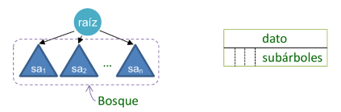

# Árbol n-ario
En la [introducción a los árboles](./intro_arboles.md) presentamos la estructura básica de árboles binarios, donde cada nodo puede tener hasta un máximo de 2 subárboles descendientes. Ahora veremos un tipo de árbol que permite que un nodo tenga una cantidad variable e indefinida de subárboles descendientes.



La imagen muestra un **árbol n-ario**, donde podríamos tener ninguno o varios subárboles descendiendo de un nodo. Al conjunto de árboles lo denominamos **bosque**. Una forma simple de estructurar este bosque es mediante una lista. Cuando estemos ante la presencia de una **hoja** veremos que no tenemos descendientes, por lo cual la **lista de subárboles estará vacía**.

> En este tipo de árboles n-arios no representamos el concepto de **árbol vacío**.

## Implementación

Dado que no necesitamos representar un árbol vacío, podemos definir una estructura con recursión directa múltiple.

```python
from typing import Any, Generic, TypeVar

T = TypeVar('T')

class ArbolN(Generic[T]):
    def __init__(self, dato: T):
        self._dato: T = dato
        self._subarboles: list[ArbolN[T]] = []
```
El caso base de la estructura recursiva sucede cuando tenemos una **hoja**, un nodo con **una lista vacía de subárboles**. En este caso optamos por definir los atributos como _privados_ para convertirlos en [propiedades](../A_Python_POO/README.md#atributos---propiedades), aunque no es estrictamente necesario hacerlo de este modo.

```python
@property
def dato(self) -> T:
    return self._dato

@dato.setter
def dato(self, valor: T):
    self._dato = valor

@property
def subarboles(self) -> list[ArbolN[T]]:
    return self._subarboles

@subarboles.setter
def subarboles(self, subarboles: list[ArbolN[T]]):
    self._subarboles = subarboles
```

### Operaciones básicas

Si bien hemos resuelto las proyecciones y modificaciones básicas utilizando _propiedades_, veamos algunas otras que podemos integrar en nuestra implementación de árbol n-ario.

```python
def insertar_subarbol(self, subarbol: ArbolN[T]):
    self.subarboles.append(subarbol)

def es_hoja(self) -> bool:
    return self.subarboles == []
```
La operación `insertar_subarbol` resultará de utilidad para extender árboles actuales con nuevos descendientes, mientras que `es_hoja` presenta si un nodo no tiene subárboles.

```python
def altura(self) -> int:
    if self.es_hoja():
        return 1
    else:
        return 1 + max([subarbol.altura() for subarbol in self.subarboles])
    
def __len__(self) -> int:
    if self.es_hoja():
        return 1
    else:
        return 1 + sum([len(subarbol) for subarbol in self.subarboles])
```
Similar al caso de los árboles binarios, podemos implementar de forma recursiva las operaciones que devuelven la altura y la cantidad de nodos. En este caso estamos utilizando una recursión múltiple a través de [list comprehensions](https://docs.python.org/3/tutorial/datastructures.html#list-comprehensions), pero también podríamos implementarlo con un bucle para visualizarlo más fácil:

```python
def altura(self) -> int:
        altura_actual = 0
        for subarbol in self.subarboles:
            altura_actual = max(altura_actual, subarbol.altura())
        return altura_actual + 1
```
En este ejemplo no explicitamos el **caso base** (cuando es una hoja) porque está **implícito en el caso donde no ingresa al bucle `for`**. Para el resto de los nodos no hojas, siempre ingresará al bucle para analizar la altura de los subárboles y quedarnos con la máxima entre ellos.

> Al implementar soluciones recursivas para operar árboles n-arios, podremos utilizar un bucle para invocar la recursión para cada subárbol, o bien, apoyarnos en el estilo del [paradigma funcional](../01_paradigma_funcional/) para resolverlo con funciones y expresiones generadoras.

#### Utilizando recursión mutua

Una alternativa interesante para implementar operaciones sobre los árboles n-arios es el uso de la **recursión mutua**. El objetivo es pensar una forma de resolver una operación sobre un árbol n-ario, la cual invoque a otra operación que reciba la lista de sus subárboles. Esta última operación invocará luego nuevamente la original para cada uno de los árboles de la lista recibida.

```
operacion(t: ArbolN) 
    -> operacion_n(subarboles: list[ArbolN])
         -> operacion(t: ArbolN)
         -> operacion(t: ArbolN)
         -> operacion(t: ArbolN)
         ...
```

La idea es que la operación sobre un árbol trate la _visita_ del nodo y luego invoque a la operación sobre sus subárboles. Esta última simplemente _itera_ de forma recursiva sobre esta lista de árboles hasta que sea vacía, donde en cada caso trata la cabeza o _head_ de esta lista recibida invocando la primera operación y combina su resultado con lo obtenido por la invocación recursiva a sí misma con el resto o _tail_ de la lista recibida de árboles.

Veamos cómo podríamos resolver la altura del árbol con esta estrategia.

```python
def altura(self) -> int:
    def altura_n(bosque: list[ArbolN[T]]) -> int:
        if not bosque:
            return 0
        else:
            return max(bosque[0].altura(), altura_n(bosque[1:]))
    
    return 1 + altura_n(self.subarboles)
```
En este caso definimos dos operaciones `altura` y `altura_n`. La primera es el método de la clase que recibe al nodo actual como `self`. La segunda es una función interna que también podría haberse definido como otro método privado (no necesitamos la [clausura](../A_Python_POO/README.md#clausura) para esta situación), y recibe por parámetro un bosque, una lista de árboles. Entonces, pensamos la solución con dos operaciones que se diferencian según lo que reciben:
- la **altura de un árbol** se resuelve como: `1 + <altura máxima que tiene un bosque>`
- la **altura máxima de un bosque** se resuelve como: 
    - `0`, si la lista de árboles es vacía
    - el `máximo` entre la `<altura del primer árbol de la lista>` y la `<altura máxima que devuelven los árboles restantes>`

Esta forma de pensar soluciones sobre árboles n-arios es muy útil para resolver problemas a través del **paradigma funcional**, ya que permiten modelarlas utilizando sólo **funciones puras**.

> El objetivo es pensar la solución utilizando dos operaciones. La primera recibe por parámetro **un árbol** y la segunda recibe por parámetro **un bosque o lista de árboles**.

### Ejercicio: Igualdad
Implementar el método `__eq__()` que permita identificar si dos árboles n-arios son iguales.

## Estrategias de recorrido
Analicemos ahora cómo implementar los recorridos en este tipo de árboles.

### DFS
El proceso es el mismo que vimos para [árboles binarios](./intro_arboles.md#primero-en-profundidad---dfs) y tenemos dos variantes: [preorder](./intro_arboles.md#preorder) y [postorder](./intro_arboles.md#postorder).

- **preorder**: Primero visitamos el nodo raíz y luego visitamos con el mismo orden los subárboles de izquierda a derecha (esto último es arbitrario, podría ser de derecha a izquierda).
- **postorder**: Primero visitamos con el mismo orden los subárboles y luego visitamos el nodo raíz.

> Nuevamente, la operación de _visita_ es una abstracción que luego puede adoptar diferentes comportamientos según el problema que deseamos resolver al recorrer un árbol.

Veamos un ejemplo de recorrido **preorder** donde construimos una lista con los nodos visitados en el orden mencionado.

```python
def preorder(self) -> list[T]:
    return reduce(
        lambda recorrido, subarbol: recorrido + subarbol.preorder(), 
        self.subarboles, 
        [self.dato]
    )
```
Apoyándonos en el paradigma funcional, recurrimos a la operación [reduce](../01_paradigma_funcional/README.md#reduce) para generar el recorrido. Inicialmente, comenzamos con una lista con el dato del nodo raíz (valor inicializado de la reducción). El iterable de la reducción son los subárboles del nodo, por lo cual si fuese una hoja la reducción devuelve simplemente la lista de inicialización que incluye sólo al nodo actual. La función reductora concatena la lista construida con el resultado del recorrido de cada subárbol.

Veamos una versión con un estilo más imperativo.

```python
def preorder(self) -> list[T]:
    recorrido = [self.dato]
    for subarbol in self.subarboles:
        recorrido += subarbol.preorder()
    return recorrido
```
En esta solución inicializamos el recorrido con el dato del nodo actual, el cual sería retornado así si fuese una hoja. En caso de que el nodo tuviera descendientes, para cada uno de ellos se realiza la misma operación `preorder` y se concatena en el recorrido construido.

Por último, veamos otra estrategia de resolución utilizando la recursión mutua como vimos en el caso de [altura](#utilizando-recursión-mutua).

```python
def preorder(self) -> list[T]:
    def preorder_n(bosque: list[ArbolN[T]]) -> list[T]:
        if not bosque:
            return []
        else:
            return bosque[0].preorder() + preorder_n(bosque[1:])

    return [self.dato] + preorder_n(self.subarboles)
```
Con este diseño recursivo podemos utilizar funciones puras para resolver el problema. La operación `preorder` tiene como objetivo generar el recorrido en una lista a partir de un árbol recibido (siendo un método, el árbol se recibe con `self` en la primera invocación). Su retorno es sencillo, devuelve una lista inicializada con el dato del nodo raíz, concatenada con la lista de los recorridos de sus subárboles.

La operación `preorder_n` recibe la lista de árboles y para cada uno de ellos invoca `preorder` para generar su recorrido, el cual luego concatena con el recorrido resultante de los árboles restantes de la lista.

### Ejercicio: postorder
Implementar un método que devuelva la lista de datos de nodos visitados en orden DFS postorder. Definirla con dos versiones: recursión múltiple directa y recursión mutua.

### BFS
La estrategia del recorrido **BFS** es la misma aplicada para los [árboles binarios](./intro_arboles.md#primero-a-lo-ancho---bfs), donde se debe implementar la operación con el apoyo de una **cola explícita**. La diferencia es que deberemos incorporar un bucle que encole todos los subárboles del nodo en cada iteración.

```python
def bfs(self):
    def recorrer():
        if q:
            actual = q.pop()                    # desencolar árbol visitado
            visitar(actual.dato)
            for subarbol in actual.subarboles:  # para cada subárbol
                q.insert(0, subarbol)           # encolar subárbol
            recorrer()
            
    q: list[ArbolN[T]] = [self]                 # encolar raíz
    recorrer()
```
El algoritmo es muy parecido al del árbol binario, sólo que ahora encolamos todos los subárboles utilizando el `for`. En este caso optamos por aprovechar la [clausura](../A_Python_POO/README.md#clausura) de `recorrer` que contiene la referencia de la cola `q`, por lo cual podemos accederla directamente sin necesidad de pasarla como argumento a la operación.

### Ejercicio: BFS para n-ario
Implementar una versión de BFS que devuelva una lista con los datos de los nodos visitados en el orden correspondiente.

### Ejercicio: Copia
Implementar una función `copy` que devuelva una copia de la estructura del árbol n-ario actual. No es necesario que se copien los datos de los nodos, pueden referenciarse al mismo objeto.

### Ejercicio: Recorrido guiado
Implementar una operación que dado un árbol n-ario y una lista de enteros devuelva el dato del nodo que corresponda con ese camino. Por ejemplo, si se pasa una lista vacía, debe devolver el dato del nodo raíz. Si se pasa una lista con [0, 2, 1] debe ir al primer subárbol, luego al tercer subárbol y finalmente al segundo subárbol, del cual devuelve el dato de esa raíz. Si no se encuentra, lanza una excepción de valor.
