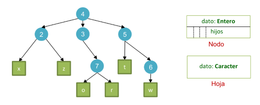
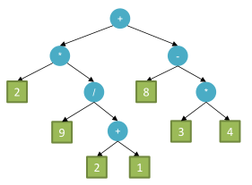
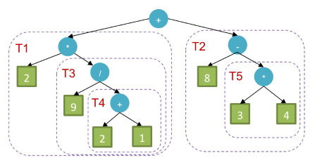

# Árboles con nodos y hojas
En esta parte no veremos un tipo de árbol en especial, sino que plantearemos una forma de construir árboles con alguna particularidad: **los nodos intermedios tienen un tipo de dato distinto a los nodos hojas**. 

## Tipos de datos en un árbol
Hasta el momento los árboles que definimos estaban parametrizados con un único tipo de dato que viene definido por una variable de tipo `T`. Esto implica que **todos los nodos del árbol tendrán asociado un contenido con ese mismo tipo de dato** `T`. 

Por ejemplo, un árbol binario de números enteros sería declarado como:
```python
arbol_enteros: ArbolBinario[int]
```
O un organigrama de personas que trabajan en cierta organización podría declararse así:
```python
organigrama: ArbolN[Empleadx]
```
En ambos ejemplos todos los nodos representan el mismo tipo de contenido. La pregunta obvia es entonces, ¿cómo podemos hacer para definir una estructura arbórea con nodos que tengan distintos tipos de contenido?

La respuesta es muy amplia y dependerá de qué estructura queremos modelar, pero vamos a intentar responderla con un caso especial: **un árbol donde sus hojas pueden adoptar un tipo de dato distinto que el resto de los nodos**.



Aquí la idea sería que las hojas adoptan valores (contenido) de tipo `Caracter`, mientras que los nodos restantes contienen un dato de tipo `Entero`. Esta idea es extensible a otras estructuras, por ejemplo con tipos de nodos distintos según si están en un nivel par o impar del árbol.

## Definición genérica
Continuamos entonces definiendo nuestro árbol especial con estas consideraciones:
- No existe el concepto de árbol vacío.
- Su elemento mínimo será una hoja.
- Se diferencian los nodos que son hojas: el contenido de nodos intermedios (incluida la raíz) **puede** ser de un tipo de dato distinto al de las hojas.
    - Tipo de dato de las hojas: `T`
    - Tipo de dato de nodos no hojas: `S`

> De la misma forma que utilizamos abstracciones existentes para crear otras, también podríamos utlizar esta estructura propuesta para definir los [árboles n-arios](arbol_n-ario.md) que vimos. Es una generalización de éstos.

Contemplemos algunas consideraciones sobre las operaciones básicas que tendría este árbol:
- El constructor debería generar una hoja, recibiendo un dato de tipo `T`.
- Podríamos agregar un método constructor `crear_nodo_y_hojas()` para generar árboles con al menos dos nodos.
- La operación `insertar_subárbol()` debería validar que no se aplique sobre una hoja, porque se convertiría en un nodo intermedio y tendría que tener otro tipo de dato como contenido.

## Implementación
Lamentablemente en Python no tendremos forma de hacer una implementación segura de este tipo de árboles, porque la estrategia de anotaciones de tipos no es suficiente para simular completamente un type checker como el de un lenguaje de tipado estático (Java). De todas formas, intentaremos aproximarnos con una solución apoyada en atributos privados de la estructura.

### Estructura
```python
from typing import Generic, TypeVar

T = TypeVar('T')
S = TypeVar('S')

class ArbolH(Generic[T, S]):
    def __init__(self, dato: T | S):
        self._dato: T | S = dato
        self._subarboles: list[ArbolH[T, S]] = []
        self._tipo_hoja = type(dato)
        self._tipo_nodo = None
```
Idealmente, el el tipo `S` no debería aceptarse en el constructor, ya que estamos generando un nodo hoja, pero por limitación del lenguaje se permite. Luego, la estructura es similar al árbol n-ario, sólo que incorporamos dos atributos para guardar los tipos de datos con los cuales se crea el árbol. Esto resulta útil para validarlos si es necesario.

### Creación de nodo intermedio
La creación de un árbol con un nodo intermedio y una o más hojas podría implementarse con un método constructor estático.
```python
@staticmethod
def crear_nodo_y_hojas(dato_raiz: S, *datos_hojas: T) -> "ArbolH[T, S]":
    if not datos_hojas:
        raise ValueError("Se requiere al menos un dato para las hojas")
    if (not all([isinstance(dato, type(datos_hojas[0])) for dato in datos_hojas])):
        raise ValueError("Todos los datos de las hojas deben ser del mismo tipo")
    
    nuevo = ArbolH(dato_raiz)
    for dato in datos_hojas:
        subarbol = ArbolH(dato)
        subarbol._tipo_nodo = type(dato_raiz)
        nuevo._subarboles.append(subarbol)
    nuevo._tipo_nodo = type(dato_raiz)
    nuevo._tipo_hoja = type(datos_hojas[0])
    return nuevo
```
De esta forma, al generar un nodo intermedio almacenamos su tipo de dato en el atributo `_tipo_nodo` y hacemos lo mismo para el tipo de dato de las hojas en `_tipo_hoja`. Previamente, validamos que cada uno de los argumentos de los datos de hojas pasados en `*datos_hojas` corresponda al mismo tipo de dato. Así quedaría creado un árbol consistente en sus tipos con un nodo intermedio y uno o más nodos hojas.

> Esta solución es una simplificación muy básica de validación de tipos ya que no permitiría construir árboles paramétricos aceptando subtipos de los instanciados, y tampoco podría generalizar a supertipos en la jerarquía de herencia.

La construcción comienza instanciando un objeto de `ArbolH` para generar un nodo intermedio, continuando por la generación de las hojas donde se les indica el tipo de dato del nodo intermedio y se incorporan a la lista de subárboles. Se completa la configuración del nodo `nuevo` indicando los tipos de datos del mismo y sus hojas.

También podríamos haber definido esta lógica directamente en el constructor, para permitir la creación de objetos de este tipo de árbol para casos de nodos hojas o nodos intermedios con un conjunto de hojas.

```python
def __init__(self, dato: T | S, *datos_hojas: T):
    self._dato: T | S = dato
    self._subarboles: list[ArbolH[T, S]] = []
    self._tipo_nodo = None
    self._tipo_hoja = type(dato)
    if datos_hojas:
        if not all([isinstance(hoja, type(datos_hojas[0])) for hoja in datos_hojas]):
            raise ValueError("Todos los datos de las hojas deben ser del mismo tipo")
        for hoja in datos_hojas:
            subarbol = ArbolH(hoja)
            subarbol._tipo_nodo = type(dato)
            self._subarboles.append(subarbol)
        self._tipo_nodo = type(dato)
        self._tipo_hoja = type(datos_hojas[0])
```

### Inserción de subárboles
Finalmente, la inserción de subárboles debe contemplar que estamos incorporando una estructura con mismos tipos de datos para sus nodos y hojas. En primer lugar, no podemos insertar un subárbol en una hoja, ya que ésta pasaría a ser un nodo intermedio y podría no ser consistente con el tipo de dato que tiene.

```python
def insertar_subarbol(self, subarbol: "ArbolH[T,S]"):
    if self.es_hoja():
        raise ValueError("No se pueden insertar subárboles en un nodo hoja")

    if not self._son_mismos_tipos(subarbol):
        raise ValueError("El árbol a insertar no es consistente con los tipos de datos del árbol actual")

    subarbol._tipo_nodo = self._tipo_nodo
    self.subarboles.append(subarbol)
```

Podemos insertar tanto nodos intermedios como hojas, para lo cual hacemos lo siguiente:
- Si se inserta una hoja, se valida que el tipo de dato de hojas coincida con el árbol actual y se asigna el tipo de dato de nodos intermedios en el atributo de la hoja insertada.
- Si se inserta un nodo intermedio, se validan ambos tipos de datos con el árbol actual.

Estas validaciones las abstraemos en un método interno `_son_mismos_tipos()` para facilitar la implementación.

```python
def _son_mismos_tipos(self, otro: "ArbolH[T,S]") -> bool:
    return (
        isinstance(otro, ArbolH) and (
            self._tipo_nodo == otro._tipo_nodo or self.es_hoja() or otro.es_hoja()
        ) and self._tipo_hoja == otro._tipo_hoja
    )
```
Esta operación nos devuelve la validación completa entre dos nodos de un árbol `ArbolH`. La validación del tipo de dato del nodo intermedio, almacenada en `_tipo_nodo` sólo nos es relevante cuando comparamos dos nodos que no son hoja, ya que si alguno o los dos son hoja, la validación será solamente sobre el tipo de dato de la hoja. Eso último se valida siempre contemplando el atributo `_tipo_hoja`.

### Ejercicio: Validar árbol completo
Implementar un método `es_valido()` que devuelva si el árbol es consistente en sus tipos de datos. Esto implica que todos los nodos intermedios son del mismo tipo, y que todos los nodos hoja son del mismo tipo.

## Árbol de Expresión Aritmética
En múltiples libros encontraremos un tipo de árbol particular que modela una **expresión aritmética**, es un lindo ejemplo para ver una aplicación del árbol que estamos viendo.

### Notación polaca inversa
En general nos acostumbramos a escribir las operaciones aritméticas en formato **infijo**, por ejemplo: `3 + 5`. El operador de suma `+` está ubicado **entre** los operandos Existen otras maneras de escribirlas, por ejemplo, en formato **prefijo** sería `+ 4 2`, algo similar a como definimos las funciones en lenguajes de programación: `suma(4, 2)`. También, podríamos escribirla en formato **postfijo**, `4 2 +`, que a veces se la suele definir como **notación polaca inversa**, donde primero se escriben los operandos y al final se agrega el operador.

> La notación polaca inversa puede resultar útil para realizar evaluaciones de expresiones aritméticas a través de una estructura arbórea.

### Modelando el problema
Modelaremos una estructura que permita evaluar expresiones sencillas con algunas operaciones, pero será fácilmente extensible para incorporar algunas otras.

Comencemos con una simple expresión aritmética:
```
2 ∗ 9 / (2 + 1) + 8 − 3 ∗ 4 = 2
```
Esta expresión la podemos evaluar a través de proceso recursivo, utilizando la estrategia _divide & conquer_. Por ejemplo, es posible dividir la **expresión** original en dos (podrían ser más) **expresiones** a partir del operador de la suma, lo cual quedaría como una única operación suma con dos **términos**, `T1` y `T2`.

```
Expresión original: T1 + T2 = 2
T1 = 2 ∗ 9 / (2 + 1)
T2 = 8 − 3 ∗ 4 = 2
```

Se descompone así el problema inicial en dos subproblemas que, a su vez, se resuelven de la misma forma porque tanto `T1` como `T2` **son también expresiones aritméticas**. La evaluación de la expresión completa se resuelve de forma recursiva y por eso es simple de modelar con la estructura arbórea siguiente.



La decisión de ubicar la operación `+` en la raíz es arbitraria, podríamos haber usado la `-` como raíz también. En este caso se da la situación que cada expresión se compone de un operador (raíz) y dos operandos (subárboles), lo cual forma un árbol binario, resultado de la expresión del ejemplo. Pero podemos pensar que aceptamos más de dos operandos para aplicar la operación (si lo soporta).

Los nodos en azul son aquellos nodos intermedios que representan las operaciones y los nodos hojas son los que representan los valores literales, aquellos términos irreducibles. **Ambos tipos de nodos son igualmente expresiones aritméticas**.

### Implementación ExpresionAritmetica
En primer lugar estableceremos algunas clases que nos faciliten el modelado de las operaciones ariméticas a soportar. Se puede ver el código completo en [expresion_aritmetica.py](./tads/expresion_aritmetica.py).

```python
from abc import ABC, abstractmethod
from typing import TypeAlias

Number: TypeAlias = int | float

class Operador(ABC):
    simbolo: str

    @staticmethod
    @abstractmethod
    def operar(a: Number, b: Number) -> Number:
        ...
    
    def __str__(self) -> str:
        return self.simbolo

class Suma(Operador):
    simbolo: str = '+'

    @staticmethod
    def operar(a: Number, b: Number) -> Number:
        return a + b
```
La superclase abstracta `Operador` establece una variable de clase `simbolo` que almacena el caracter correspondiente a cada operación y un método abstracto estático para que las subclases implementen cómo se resuelve la operación. Se ejemplifica la especialización del operador `Suma` que implementa la operación sobre dos operandos.

Debido a que nos apoyamos en el árbol genérico que vimos, vamos a especializarlo para construir nuestro modelo de expresión arimética. En Python puede resultar que no sea el mejor enfoque, por lo mencionado acerca del tipado dinámico y la simulación con type hints, pero intentaremos una implementación rápida.

```python
class ExpresionAritmetica(ArbolH[Number,Operador]):
    def __init__(self, dato: Number):
        super().__init__(dato)

    @staticmethod
    def valor(valor: Number) -> "ExpresionAritmetica":
        return ExpresionAritmetica(valor)
    
    def es_valor(self) -> bool:
        return self.es_hoja()
```
En su instancia más simple, una expresión aritmética es un valor literal, un número que puede ser `int` o `float` según la definición que agregamos con `TypeAlias`. Obviamente, una expresión como esta, que no puede reducirse, se representa como una hoja del árbol. Se agrega un método constructor que produce este tipo de expresiones finales. La proyección `es_valor()` se apoya en el método de la superclase directamente para determinar si estamos ante un nodo hoja.

```python
@staticmethod
def _crear_operacion(operador: Operador, operando_1: "ExpresionAritmetica", operando_2: "ExpresionAritmetica") -> "ExpresionAritmetica":
    nuevo = ExpresionAritmetica(operador)
    nuevo._insertar_subarbol_nocheck(operando_1)
    nuevo._insertar_subarbol_nocheck(operando_2)
    return nuevo

@staticmethod
def suma(operando_1: "ExpresionAritmetica", operando_2: "ExpresionAritmetica") -> "ExpresionAritmetica":
    return ExpresionAritmetica._crear_operacion(Suma(), operando_1, operando_2)
```
Los otros métodos constructores son aquellos que producen expresiones reducibles, aquellas que involucran una operación, los nodos intermedios. Se implementa un método creacional para cada tipo de operación, en el ejemplo vemos la que corresponde a `Suma`. Debido a que los métodos de creación de estos tipos de expresiones son similares y sólo varían en el tipo de `Operación`, se normaliza el proceso en un método interno `_crear_operacion` que instancia un nuevo nodo del árbol y lo convierte en nodo intermedio al incorporarle las expresiones (términos u operandos). La operación `_insertar_subarbol_nocheck` es una salida rápida como mencionamos, consecuencia de las limitaciones de lenguaje con el uso de _Generics_.

Con estas implementaciones ya estaríamos en condiciones de construir la estructura de la expresión arimética como vimos en la imagen del principio. Nos restaría definir cómo **evaluarla**.

#### Evaluación de la expresión
Claramente, la evaluación más sencilla es la de un **valor literal**, serían las **hojas del árbol**, las expresiones irreducibles. Entonces, si tuviera que implementar esa evaluación, simplemente **retornaría el valor o dato del nodo hoja**. 

Lo interesante es resolver la evaluación de una expresión que involucra operaciones. Mencionamos que una expresión se puede subdividir en términos (subexpresiones) que le aplicamos alguna operación. A su vez, hablamos algo de la notación polaca inversa, donde escribíamos las expresiones en formato **postfijo**. 



Si miramos el árbol generado, podemos notar que para evaluar una expresión la podemos pensar en postfijo, donde primero evaluamos los operandos y luego le aplicamos la operación. Como en nuestro árbol de expresión un nodo raíz o intermedio corresponde a una operación y los subárboles a los operandos, la respuesta a cómo evaluar el árbol está en recorrerlo con un **DFS postorder**, ya que _visitamos_ (aplicamos la operación) al nodo raíz al final.

Este sería el orden de evaluación según los términos que vemos en la imagen de la estructura que corresponde a nuestra expresión de ejemplo:

```
2 ∗ 9 / (2 + 1) + 8 − 3 ∗ 4 = 2
Expresión = 𝑇1 + 𝑇2
Expresión = 2 ∗ 𝑇3  + 𝑇2
Expresión = 2 ∗ 9 / T4 + T2
Expresión = 2 ∗ 9 / (2 + 1) + 𝑇2
Expresión = 2 ∗ 9 / 3 + 𝑇2
Expresión = 2 ∗ 3 + 𝑇2
Expresión = 6 + (8 − 𝑇5)
Expresión = 6 + (8 − (3 ∗ 4))
Expresión = 6 + (−4)
Expresión = 2
```
El primer término evaluado es el literal `2`, el primero _más profundo_ a la izquierda de la expresión. La evaluación de `T1` queda postergada hasta que se evalúa el subárbol derecho, su segundo operando, `T3`. Por lo tanto, el **recorrido postorder** sigue camino a evaluar a ese nodo `T3` que corresponde a la división de `9` y `T4`. Así que la evaluación siguiente resuelta es la del literal `9`, y le siguen `2`, `1` y `2 + 1`, etc. Si escribiésemos esta expresión en **notación polaca inversa**, notaremos que **sigue el mismo recorrido de visita que un DFS postorder**.

```
Expresión = (2 (9 (2 1 +) /) *) (8 (3 4 *) -) +
```
Veamos entonces cómo se implementaría adaptando los recorridos vistos en árboles previos.

```python
def evaluar(self) -> Number:
    if self.es_valor():
        return self.dato_hoja()
    operador = self.dato_nodo()
    operando_1, operando_2 = self.subarboles
    return operador.operar(operando_1.evaluar(), operando_2.evaluar())
```
El caso base serán los valores literales, mientras que luego se computan los operandos con sus respectivas invocaciones a `evaluar()` para finalmente resolver la evaluación de la expresión actual con la operación `operar()` que definimos para cada una de las clases especializadas de `Operador`.

### Ejercicio: Construir desde tuplas anidadas
Implementar un método que permita construir una expresión aritmética a partir de una estructura de tuplas anidadas, donde cada tupla tenga 3 elementos: `(expresión_1, operación, _expresión_2)`. Como una expresión puede ser otra tupla, la tupla que le pasemos para construir la expresión final puede ser anidada. 

Por ejemplo: ( (2, *, (9, /, (2, +, 1) ) ), +, (8, -, (3, *, 4) ) )

### Ejercicio: Extender a operaciones n-arias
Extender la clase `ExpresionAritmetica` de forma que soporte operaciones n-arias, incluyendo unarias, ternarias, etc.